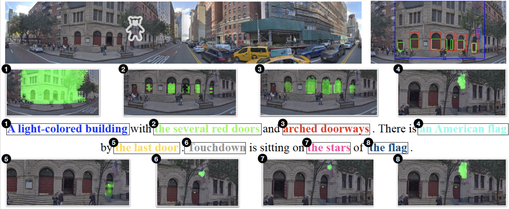

# A Joint Study of Phrase Grounding and Task Performance in Vision and Language Models

Welcome to the official code repository for the paper "A Joint Study of Phrase Grounding and Task Performance in Vision and Language Models" authored by [Noriyuki Kojima](https://kojimano.github.io/), [Hadar Averbuch-Elor](http://www.cs.cornell.edu/~hadarelor/), and [Yoav Artzi](https://yoavartzi.com/).
<p align="center">
  
</p>

## About
[Link to the Paper]()

## Abstract
Key to tasks that require reasoning about natural language in visual contexts is grounding words and phrases to image regions. However, observing this grounding in contemporary models is complex, even if it is generally expected to take place if the task is addressed in a way that is conductive to generalization. We propose a framework to jointly study task performance and phrase grounding, and propose three benchmarks to study the relation between the two. Our results show that contemporary models demonstrate inconsistency between their ability to ground phrases and solve tasks. We show how this can be addressed through brute-force training on ground phrasing annotations, and analyze the dynamics it creates. 

## Codebase

### Installation
1. Set up the conda environment: `conda create -n grounding python=3.8`
2. Clone the repository.
3. Install necessary dependencies: `pip install -r requirements.txt`

### Subdirectories
- `READMEs/`: Contains instructions for training and testing models.
- `src/`: Contains scripts to train and test models.
- `data/`: Stores data files.
- `results/`: Stores experimental outcomes, like model checkpoints.
- `media/`: Features images, GIFs, and videos for presentations and PRs.

### Quick-start Guide

#### 1. Preparing the Data
To prepare and preprocess data, refer to the [instructions provided](https://github.com/lil-lab/phrase_grounding/tree/main/src/preprocessing).

#### 2. Training and Testing Models
To train and test models, refer to the [instructions provided](https://github.com/lil-lab/phrase_grounding/tree/main/READMEs).


### License
Licensed under the MIT License.

## How to Cite
If our work aids your research, kindly reference our paper:
```
@misc{Kojima2023:grounding,
  title         = {A Joint Study of Phrase Grounding and Task Performance in Vision and Language Models},
  author        = {Noriyuki Kojima and Hadar Averbuch-Elor and Yoav Artzi},
  year          = {2023},
  eprint        = {},
  archiveprefix = {arXiv}
}
```
